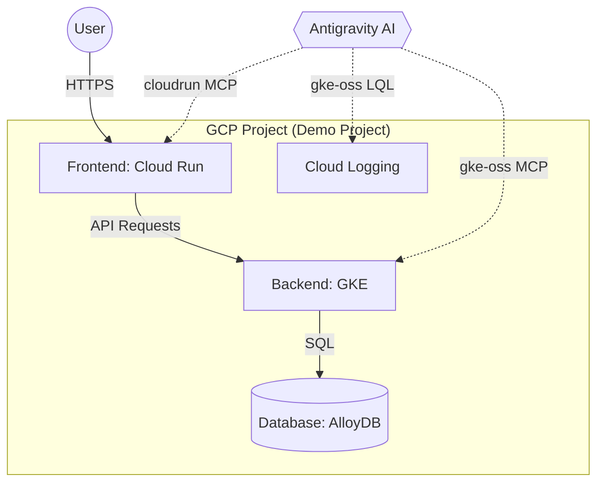

# GCP Developer Playground - Native Cloud Development Demo

## Overview
A comprehensive demonstration of Google Antigravity's ability to build, deploy, and manage GCP-native applications using specialized MCP servers. This demo illustrates a complete developer lifecycle within a "playground" environment, from initial service deployment to real-time debugging using Cloud Logging.

## Purpose
This demo highlights Antigravity's capabilities in:
- **Cloud-Native Deployment**: Using `cloudrun` and `gke-oss` tools for infrastructure management.
- **Cross-Service Orchestration**: Managing a 3-tier application across Cloud Run, GKE, and AlloyDB.
- **Integrated Debugging**: Fetching and analyzing GCP log errors directly within Antigravity.
- **GCP-Specific Workflows**: Showcasing how MCP servers extend Antigravity's knowledge of Google Cloud.

## Use Case: 3-Tier Web Application
A modern, scalable web application consisting of:
1.  **Frontend (Cloud Run)**: A React/Next.js interface for user interactions.
2.  **Backend (GKE)**: A Node.js API service running on a Kubernetes cluster for heavy workload processing.
3.  **Database (AlloyDB)**: A high-performance PostgreSQL-compatible database for data persistence.

---

## Technical Architecture



---

## Key GCP MCP Showcases

### 1. **Cloud Run Operations (`cloudrun` MCP)**
Antigravity can manage the lifecycle of the frontend service:
- **Deployment**: Deploying container images to Cloud Run.
- **Scaling**: Adjusting concurrency and instance limits.
- **Service Inspection**: Fetching service details and status.

### 2. **GKE Cluster Management (`gke-oss` MCP)**
Antigravity acts as a cloud-native SRE for the backend:
- **Workload Deployment**: Deploying manifests to GKE clusters.
- **Cluster Introspection**: Checking pod health, service status, and node reports.
- **SOS Reports**: Generating diagnostic reports for unhealthy nodes.

### 3. **Log Analysis and Debugging (`gke-oss` LQL)**
This is a core part of the demo, showcasing proactive debugging:
- **Error Discovery**: Using `gke-oss_query_logs` to fetch `k8s_application_logs` or `k8s_event_logs`.
- **Intelligent Triage**: Antigravity identifies the root cause of log errors (e.g., OOM, crash loops, database connection failures).
- **Automated Remediation**: Antigravity proposes and applies fixes based on the logs (e.g., updating memory limits or fixing connection strings).

---

## Simulated "Dev" Cycle Workflow

### Step 1: Rapid Provisioning
A developer asks Antigravity: *"Deploy a new instance of our 3-tier app for testing."*
- Antigravity uses `mcp_cloudrun_deploy_container_image` for the frontend.
- Antigravity uses `mcp_gke-oss_gke_deploy` for the backend.

### Step 2: Proactive Monitoring
While the app is running, Antigravity regularly checks for anomalies:
- *"I've detected a significant increase in 500 errors in the GKE logs."*
- Antigravity uses `mcp_gke-oss_query_logs` with a template to focus on `severity >= ERROR`.

### Step 3: Debugging Session
The developer investigates: *"Antigravity, what's wrong with the backend?"*
- Antigravity analyzes the logs: *"The backend is failing to connect to AlloyDB due to an invalid credentials secret."*
- Antigravity suggests a fix: *"I can recreate the k8s secret with the correct password from Secret Manager."*

---

## Repository Structure

```
gcp-developer-playground/
├── GEMINI.md                    # This architecture document
├── infra/                       # Deployment manifests
│   ├── cloud-run-service.yaml   # Frontend config
│   └── gke-deployment.yaml      # Backend config
├── apps/                        # Application source code
│   ├── frontend/                # Next.js app
│   └── backend/                 # Node.js API
├── scripts/                     # Helper scripts for testing
│   └── generate-errors.sh       # Script to simulate failure scenarios
└── .agents/                     # Workflows for GCP development
    └── deploy-app.md            # Step-by-step deployment guide
```

---

## Learning Outcomes
After using this playground, developers will understand:
- How **MCP servers** bridge the gap between AI and Cloud Infrastructure.
- The efficiency of **Log-Driven Development** within Antigravity.
- Best practices for multi-service architectures on **GCP**.

---

*This demo is part of the Google Antigravity demonstration ecosystem, showcasing the power of Cloud and AI collaboration.*
